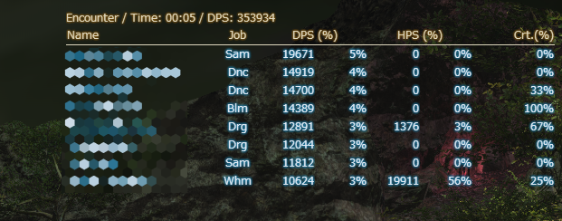
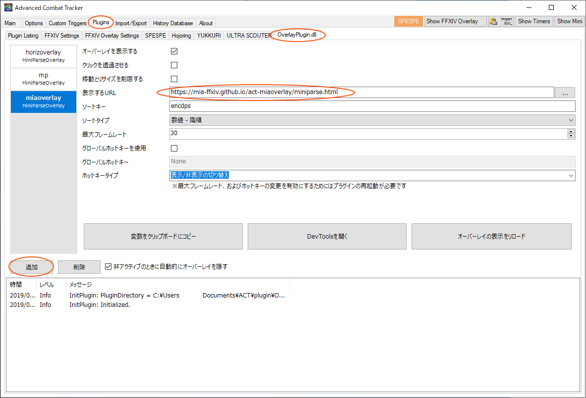
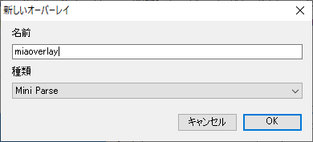

# ACT MiaOverlay

ACT Overlay Plugin 用のスキンです。
FF14 のシステム UI に馴染むデザインになっており、計測時以外表示されないようにするなど極力邪魔にならないようにしています。

昔から ACT を利用している方はデザインに見覚えがある方もいるのではないかと思います。





### 機能

- FFXIV Shadowbringer に対応
- FF14 のシステム UI に馴染むデザイン
- ペット、エギ、影身などの DPS 合算に対応
- 戦闘10 分間ない場合に自動的に非表示になります
- 自キャラ名自動判定


### 設定用 URL

```
https://mia-ffxiv.github.io/act-miaoverlay/miniparse.html
```


### 利用方法

下記の手順で利用してください。


- ACT を起動した後、Plugins ー Overlay Plugin.dll と上のタブを選択して下記の画面を出します。

- 左下の追加を押して「新しいオーバーレイ」画面を出してそこに適当な名前（ここでは miaoverlay）を入力して OK を押します。
- 表示する URL 欄に https://mia-ffxiv.github.io/act-miaoverlay/miniparse.html と入れます。
- 最後に「オーバーレイを表示する」にチェックが入っていることを確認します。








デフォルトの kagerou と入れ替えて表示するには、kagerou の「オーバーレイを表示する」のチェックを外すことにより kagerou の表示を消せます。


### 詳しい方向け説明

このオーバーレイを表示して最初は自分の名前が "YOU" と表示されますが、エギや影見などのペット相当のものを一度でも出してログを表示すると自分の名前が表示されるようになります。

これは、自キャラ名が YOU に変換されてしまう Overlay Plugin において自動的に自分の名前を抽出するために苦心しているものになります。もしかしたら一部の方は動かないかもしれませんので、ここの issue にでも報告をお願いします。

自キャラ表示がおかしくなった場合は、エギや影見などを出して木人を叩くと治ります。